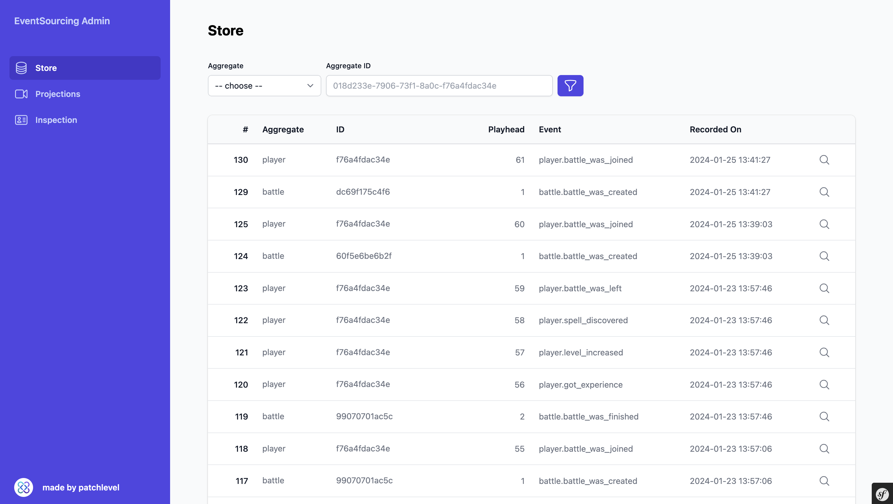
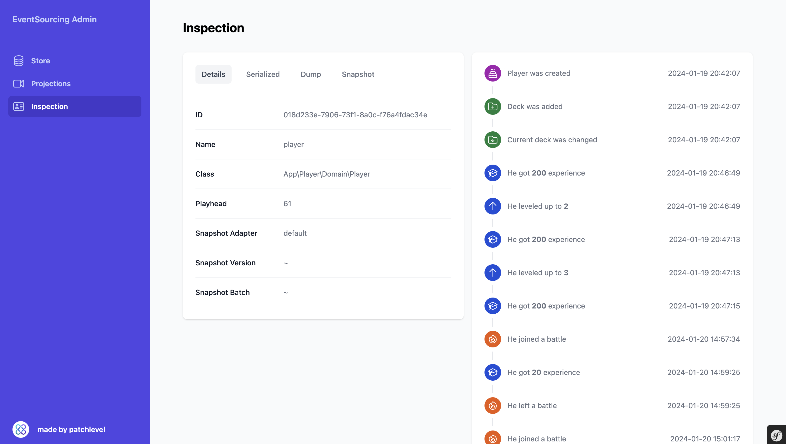
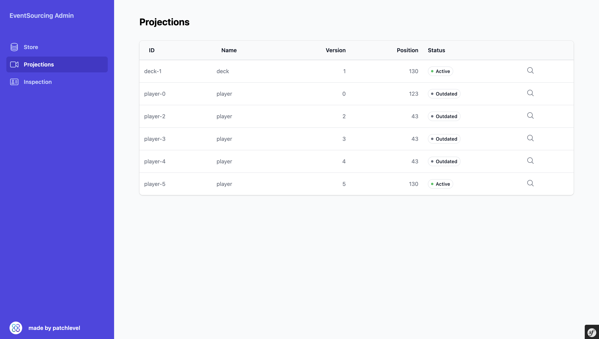
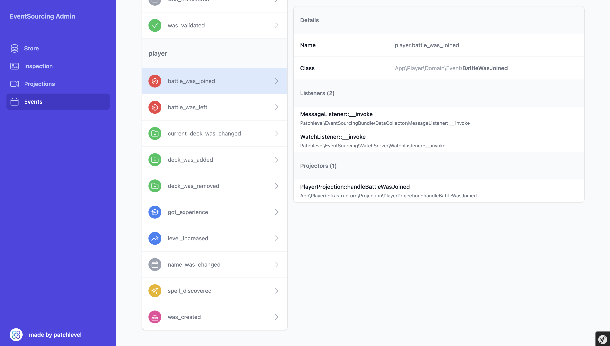

# Event-Sourcing-Bundle-Admin

This bundle provides a simple admin interface for the [patchlevel/event-sourcing-bundle](https://github.com/patchlevel/event-sourcing-bundle).

## Screenshots

### Store



### Inspector



### Projection



### Events



## Installation

```bash
composer require patchlevel/event-sourcing-bundle
```

## Configuration

```yaml
# config/packages/patchlevel_event_sourcing_admin.yaml
patchlevel_event_sourcing_admin:
    enabled: true
```

## Routes

```yaml
# config/routes/patchlevel_event_sourcing_admin.yaml
event_sourcing:
  resource: '@PatchlevelEventSourcingAdminBundle/config/routes.yaml'
  prefix: /es-admin
```
