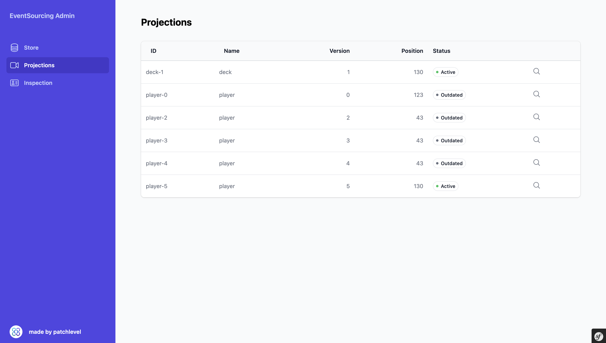

# Subscriptions

The subscriptions view lists every subscription known to the subscription engine, shows its current
state, and lets you control it. This is where you boot new projectors, rerun them, pause noisy
processors, or rebuild a projection from scratch.

## What you see

Each subscription shows its id, group, run mode and status, alongside the total number of messages
in the store so you can gauge how much work a rebuild involves. The status and run mode values come
straight from the engine, so they always match what your application reports.

## Filtering

You can narrow the list with these filters:

* **search**: match part of a subscription id
* **group**: only subscriptions in a given group
* **run mode**: only subscriptions with a given run mode
* **status**: only subscriptions with a given status

The available groups, run modes and statuses are derived from the registered subscriptions, so the
filter options reflect your actual setup.

## Controls

Each subscription exposes the operations of the subscription engine as individual actions:

* **Setup**: create the subscription so it is ready to receive events.
* **Boot**: catch a newly set up subscription up with the existing event stream.
* **Run**: process the events that have accumulated since the last run.
* **Pause**: stop a subscription from processing further events.
* **Reactivate**: bring a paused or errored subscription back to active.
* **Rebuild**: remove the subscription and boot it again from scratch.
* **Remove**: delete the subscription entirely.

:::danger
Rebuild and remove are destructive. Rebuild drops the subscription's current state and replays every
event again, and remove deletes it outright. On a large store a rebuild can take a long time and put
load on your database.
:::

:::warning
These actions run synchronously inside the web request. For a subscription that is far behind, run
and rebuild can exceed your PHP execution time limit. For large catch-ups prefer the console
commands of the event-sourcing-bundle and use the dashboard for inspection and lighter operations.
:::

## Learn more

* [How to see which events a subscriber consumes](events.md)
* [How to browse the event store a subscription processes](store.md)
* [How to run the dashboard safely in production](production-usage.md)
